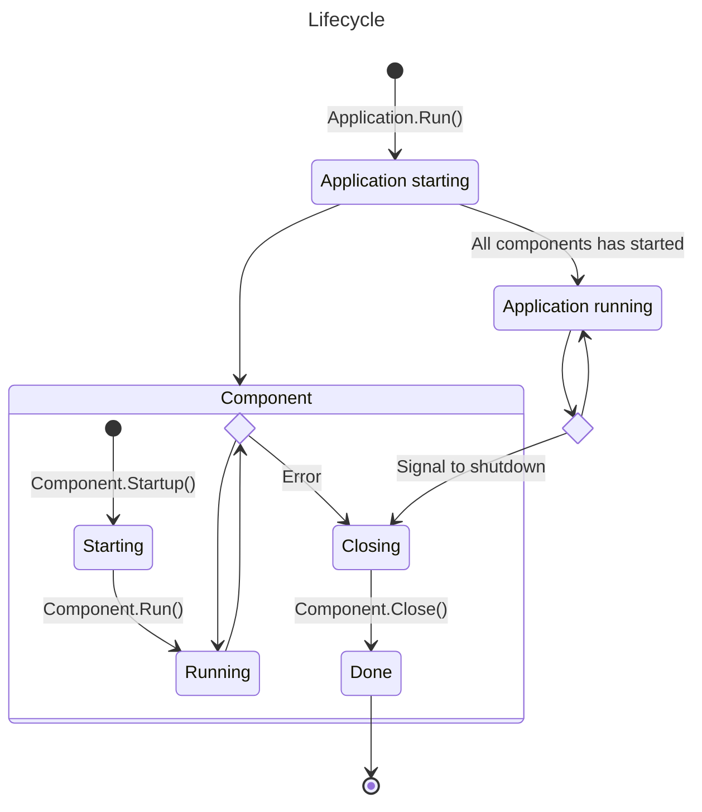

# Service base

This repository contains base components for our backend services.

# Usage

```go
// Any http.Handler compatible struct
mux := http.NewServerMux()
// Create http component
http := application.NewHttpComponent(router)
// Compose new application
app := application.NewApplications(http)
// Run blocks until application exits
err :=  app.Run()
if err ! nil{
    return err
}
```

# Structure

Each compoonent is composed of 3 functions, that will be invoked by the `Application`
- Startup
- Run
- Close

### Lifecycle

